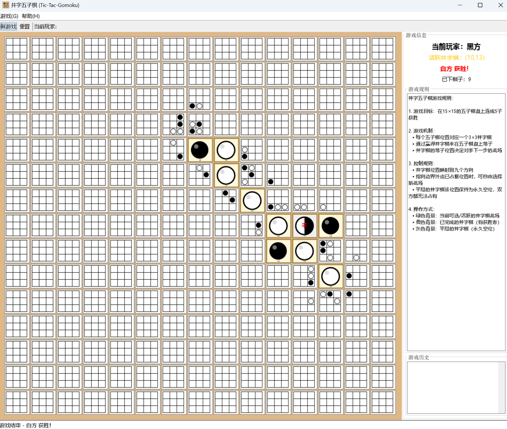

# Tic-Tac-Gomoku (井字五子棋)

一个创新的井字棋与五子棋结合的游戏，玩家在15×15的棋盘上进行游戏，每个格子都是一个3×3的井字棋小棋盘。

## 游戏规则

1. **棋盘结构**: 15×15的大棋盘，每个格子包含一个3×3的井字棋小棋盘
2. **获胜条件**: 
   - 在大棋盘上连成5子（横、竖、斜）获胜
   - 通过赢得井字棋小游戏来在对应格子上放置棋子
3. **游戏流程**:
   - 玩家轮流在井字棋小棋盘中下棋
   - 赢得井字棋的玩家在该格子放置自己的棋子（黑子或白子）
   - 平局时该格子保持空白
   - 最先在大棋盘上连成5子的玩家获胜

## 技术特性

- **Java Swing界面**: 现代化、响应式的图形用户界面
- **智能布局**: 自动调整窗口大小以保持最佳游戏体验
- **正方形格子**: 确保井字棋面板为完美正方形，提供最佳视觉效果
- **优化的棋子大小**: 五子棋棋子大小经过优化，不会遮挡井字棋网格线
- **实时游戏状态**: 显示当前玩家、游戏进度和获胜状态

## 系统要求

- Java 8 或更高版本
- Windows/macOS/Linux

## 快速开始

### 编译并运行游戏

```bash
# 编译
javac -d target/classes -cp src/main/java src/main/java/com/tictacgomoku/**/*.java

# 运行
java -cp target/classes com.tictacgomoku.TicTacGomokuGame
```

### 使用批处理文件（Windows）

```bash
# 编译游戏
compile.bat

# 运行游戏
run-game.bat
```

## 项目结构

```
src/
└── main/
    └── java/
        └── com/
            └── tictacgomoku/
                ├── TicTacGomokuGame.java    # 主游戏类
                ├── model/                    # 游戏逻辑模型
                │   ├── GameLogic.java
                │   ├── GameState.java
                │   ├── GomokuBoard.java
                │   ├── Player.java
                │   ├── Position.java
                │   └── TicTacToeBoard.java
                ├── view/                     # 用户界面组件
                │   ├── BoardPanel.java
                │   ├── GameInfoPanel.java
                │   ├── GameWindow.java
                │   └── TicTacToePanel.java
                └── util/                     # 工具类
                    ├── GameConstants.java
                    └── GameUtils.java
```

## 最新改进

### v1.1.0 - UI优化更新
- **修复棋子大小问题**: 五子棋棋子大小从40%减少到30%，防止遮挡井字棋网格
- **强化正方形约束**: 确保所有井字棋面板都是完美的正方形
- **优化布局计算**: 改进窗口大小调整和布局算法
- **清理代码结构**: 移除测试文件和过时文档，保持核心功能

## 贡献

欢迎提交问题报告和功能请求！请查看 [CONTRIBUTING.md](CONTRIBUTING.md) 了解贡献指南。

## 更新日志

详细的更新记录请查看 [CHANGELOG.md](CHANGELOG.md)。

## 许可证

本项目采用 GPL v3 许可证 - 查看 [LICENSE](LICENSE) 文件了解详情。

## 开发者

这是一个展示创新游戏设计和Java Swing GUI编程的项目。
